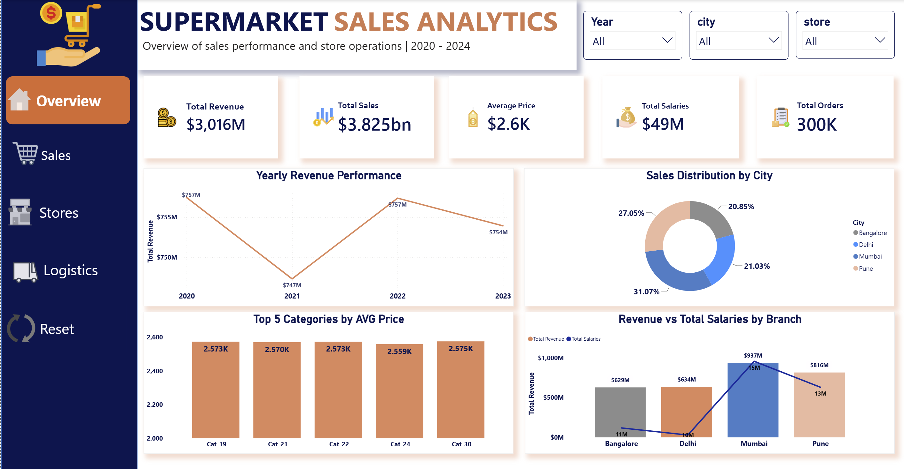
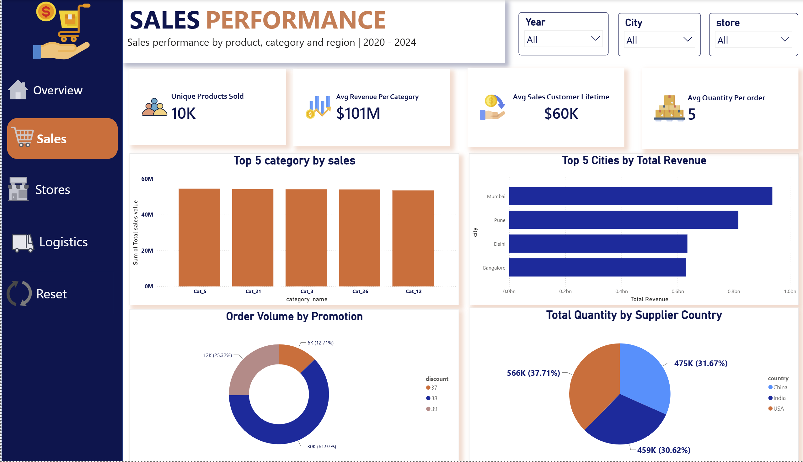
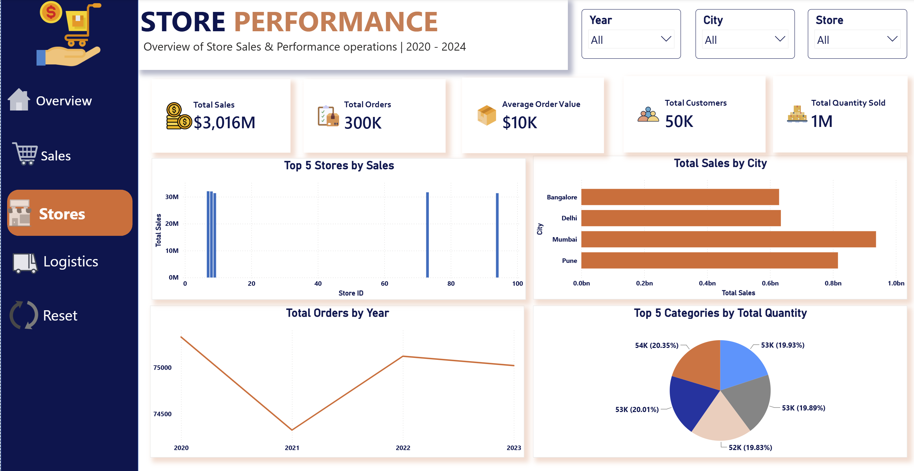
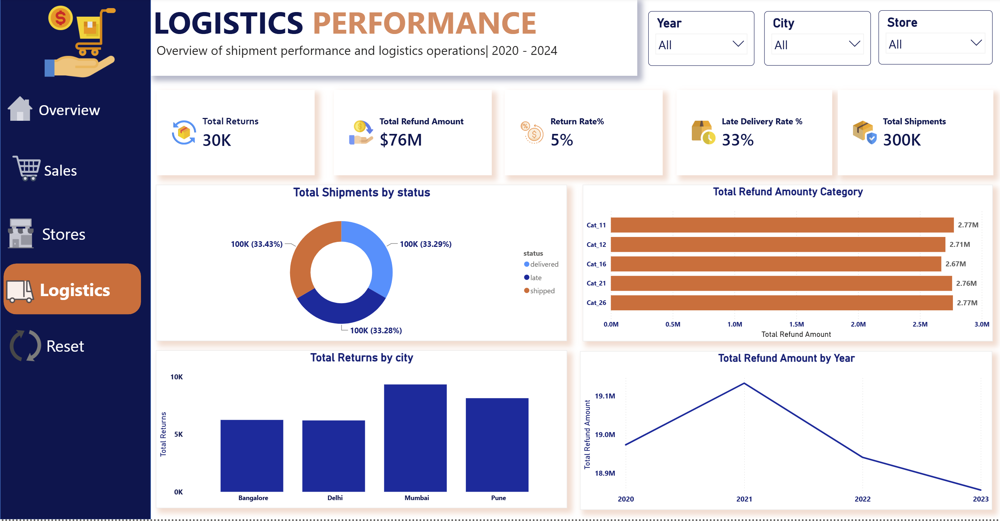

#  Interactive Supermarket Sales & Logistics Analytics Dashboard

An End-to-End Analytics Dashboard designed to evaluate sales, operational efficiency, and supply chain logistics for a supermarket chain using data spanning from **2020 to 2023**. 

This project was developed as a Graduation Project at the **National Telecommunication Institute (NTI)**.

---

##  Project Overview
The objective of this project is to transform raw, transactional supermarket data into structured, actionable business intelligence. It empowers stakeholders to track financial metrics, monitor store and logistics operations, evaluate promotion performance, and optimize supply chain performance.

---

##  Tech Stack & Methods
* **Database & ETL:** SQL Server Management Studio (SSMS) — Used for data extraction, cleaning, schema preparation, and validations.
* **Data Modeling:** Star Schema Design — Optimized table relationships with single-directional filter flows to ensure high DAX performance.
* **Calculations & Metrics:** DAX (Data Analysis Expressions) — Developed dynamic measures for revenue, order volumes, delivery metrics, and cost ratios.
* **Data Visualization & UI/UX:** Power BI — Custom visual templates, integrated navigation pane, dynamic slicers, bookmarks, and a reset filters button.

---

## 📂 Project Repository Structure

```text
├── Dataset/                     # 12 CSV files containing source relational data
├── Queries/                     # SQL scripts for ETL, data cleaning, and validation
├── Dashboards/                  # Dashboard page screenshots
│   ├── overviewDash.png         # Executive Overview page
│   ├── SalesDash.png            # Sales Analysis page
│   ├── storesDash.png           # Store Operations page
│   └── LogisticsDash.png        # Logistics & Supply Chain page
└── README.md                    # Project documentation
```
Dashboard Functional Breakdown
Executive Overview (overviewDash): High-level performance indicators tracking overall business health across 2020–2023, including Total Revenue, Total Orders, Sales Quantities, and Gross Margin.

Sales & Commercial Analysis (SalesDash): Deep-dive breakdown of product performance across categories, specific product items, and geographic distribution across cities and regions.

Store Operations (storesDash): Operational metrics evaluating individual store performance and analysis of Salary Costs against store revenue.

Logistics & Supply Chain (LogisticsDash — My Primary Contribution): Shipment tracking, Late Delivery Rate (33%), Return Rate (5%), return reasons breakdown, and total refunded values.

🖼️ Dashboard Screenshots





🔗 Live Demo & Project Files
📂 Power BI Full Report (.pbix): Download File from Google Drive https://drive.google.com/drive/folders/1O5i6EnA0qoOzOEkyoSewaPOOw1xY6Ziz?hl=ar

💼 LinkedIn Post & Demo: View LinkedIn Profile
